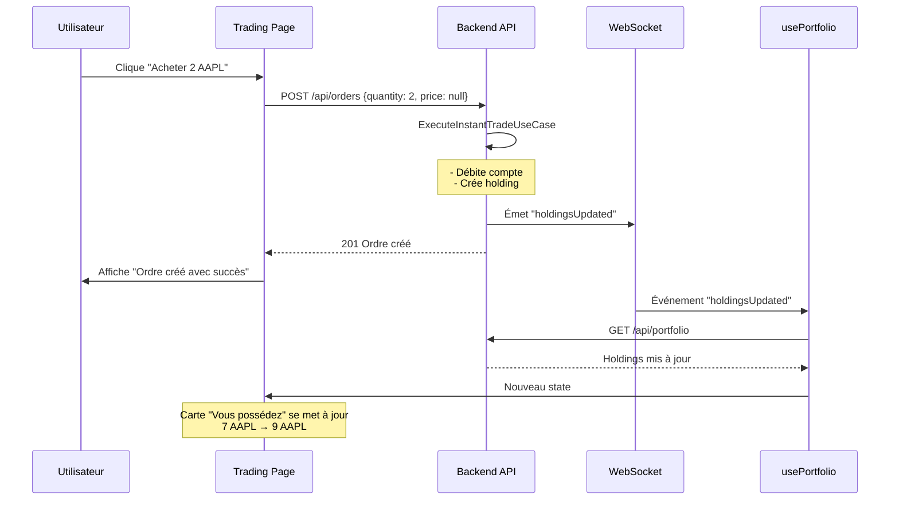
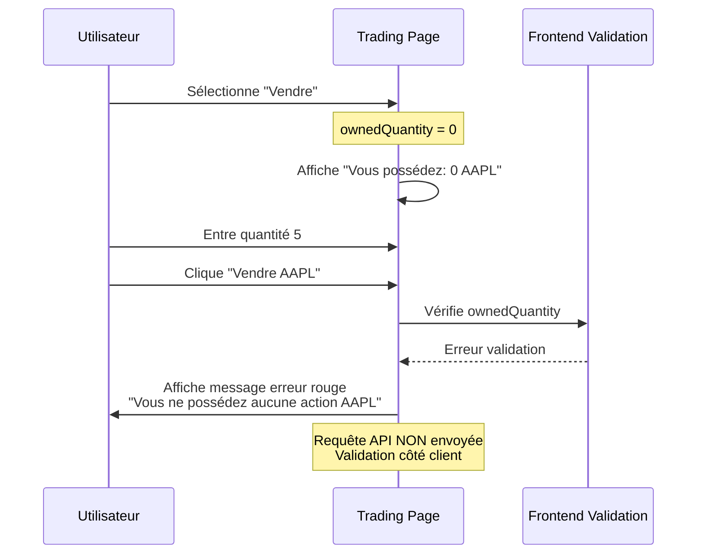

# Améliorations Frontend : Affichage et gestion des holdings

Date : 7 janvier 2026

## Modifications apportées

### 1. ✅ WebSocket dans usePortfolio

**Fichier** : `infrastructure/nextjs-frontend/src/presentation/hooks/usePortfolio.ts`

**Ajout** :
```typescript
import { useWebSocket } from './useWebSocket';

export const usePortfolio = (userId: number | null) => {
  const socket = useWebSocket(userId);
  
  // Écouter les mises à jour de holdings en temps réel via WebSocket
  useEffect(() => {
    if (socket && userId) {
      socket.on('holdingsUpdated', (holdings: any[]) => {
        console.log('⚡ Holdings mis à jour via WebSocket');
        loadPortfolio(); // Rafraîchir le portfolio complet
      });
      
      return () => {
        socket.off('holdingsUpdated');
      };
    }
  }, [socket, userId]);
}
```

**Bénéfice** : Le portfolio se met à jour automatiquement en temps réel après chaque achat/vente.

---

### 2. ✅ Affichage des holdings sur la page de trading

**Fichier** : `infrastructure/nextjs-frontend/app/trading/[symbol]/page.tsx`

#### Ajout du hook usePortfolio

```typescript
import { usePortfolio } from '@/presentation/hooks/usePortfolio';

export default function TradingPage() {
  const { holdings, refresh: refreshPortfolio } = usePortfolio(user?.id || null);
  
  // Trouver le holding pour cette action
  const currentHolding = holdings.find(h => h.stockSymbol === symbol);
  const ownedQuantity = currentHolding?.quantity || 0;
  
  // Rafraîchir après événement WebSocket
  useEffect(() => {
    if (refreshTrigger > 0) {
      refreshPortfolio();
    }
  }, [refreshTrigger]);
}
```

#### Affichage de la carte "Vous possédez"

Ajout d'une carte informative avant le formulaire d'ordre :

```tsx
{ownedQuantity > 0 && (
  <div className="mb-4 p-3 bg-sky-50 border border-sky-200 rounded-lg">
    <div className="flex items-center justify-between">
      <span className="text-sm text-slate-600">Vous possédez :</span>
      <span className="text-lg font-bold text-sky-700">{ownedQuantity} {symbol}</span>
    </div>
    {currentHolding && (
      <div className="mt-2 pt-2 border-t border-sky-200 text-xs text-slate-600">
        <div className="flex justify-between">
          <span>Prix moyen d'achat :</span>
          <span className="font-mono">{formatAmount(currentHolding.averagePurchasePrice)}</span>
        </div>
        <div className="flex justify-between mt-1">
          <span>Valeur actuelle :</span>
          <span className="font-mono font-semibold">{formatAmount(currentHolding.currentValue)}</span>
        </div>
        <div className="flex justify-between mt-1">
          <span>Gain/Perte :</span>
          <span className={`font-mono font-semibold ${currentHolding.gainLoss >= 0 ? 'text-emerald-600' : 'text-rose-600'}`}>
            {currentHolding.gainLoss >= 0 ? '+' : ''}{formatAmount(currentHolding.gainLoss)}
          </span>
        </div>
      </div>
    )}
  </div>
)}
```

**Affichage** :

```
┌─────────────────────────────────────┐
│ Vous possédez : 7 AAPL              │
│ ─────────────────────────────────── │
│ Prix moyen d'achat : 148,71 €       │
│ Valeur actuelle :    1 054,00 €     │
│ Gain/Perte :         +12,97 €       │
└─────────────────────────────────────┘
```

---

### 3. ✅ Validation des ventes avec vérification de quantité

#### Validation dans handleCreateOrder

```typescript
const handleCreateOrder = async (e: React.FormEvent) => {
  e.preventDefault();
  
  const orderQuantity = parseInt(quantity);

  // Validation pour les ordres de vente
  if (orderType === 'SELL') {
    if (ownedQuantity === 0) {
      setOrderError(`Vous ne possédez aucune action ${symbol}. Impossible de vendre.`);
      return;
    }
    
    if (orderQuantity > ownedQuantity) {
      setOrderError(`Quantité insuffisante. Vous possédez ${ownedQuantity} action(s), vous essayez d'en vendre ${orderQuantity}.`);
      return;
    }
  }

  // Continuer avec la création de l'ordre...
};
```

#### Indication visuelle dans le champ Quantité

```tsx
<input
  type="number"
  min="1"
  max={orderType === 'SELL' ? ownedQuantity : undefined}  // Limite pour les ventes
  value={quantity}
  onChange={(e) => setQuantity(e.target.value)}
  className="input-premium w-full"
  required
/>
{orderType === 'SELL' ? (
  <p className="text-xs text-slate-500 mt-1">
    Vous possédez: <span className="font-semibold text-sky-600">{ownedQuantity}</span> {symbol}
  </p>
) : (
  <p className="text-xs text-slate-500 mt-1">
    Disponibles: {stock.availableShares.toLocaleString()}
  </p>
)}
```

**Résultat** :
- Pour **Acheter** : Affiche "Disponibles: 999 998"
- Pour **Vendre** : Affiche "Vous possédez: 7 AAPL" (en bleu)

---

## Flux complet avec les améliorations

### Scénario : Achat de 2 actions AAPL



### Scénario : Tentative de vente sans actions



---

## Avantages des améliorations

### UX améliorée

1. **Feedback immédiat** : L'utilisateur voit immédiatement ses actions après un achat
2. **Prévention d'erreurs** : Impossible de vendre plus d'actions qu'on possède
3. **Information claire** : Affichage du prix moyen, valeur actuelle, gain/perte
4. **Temps réel** : Pas besoin de rafraîchir la page

### Performance

1. **WebSocket** : Évite le polling constant de l'API
2. **Validation frontend** : Réduit les appels API inutiles
3. **Updates ciblées** : Seul le portfolio est rafraîchi quand nécessaire

### Maintenance

1. **Code réutilisable** : `usePortfolio` avec WebSocket peut être utilisé ailleurs
2. **Séparation des responsabilités** : Validation métier claire
3. **Logs clairs** : Debug facilité avec console.log

---

## Test des améliorations

### 1. Test WebSocket

**Étapes** :
1. Ouvrir la page Trading AAPL
2. Ouvrir la console du navigateur
3. Acheter 2 actions au prix du marché
4. Vérifier dans la console :
   ```
   ⚡ [usePortfolio] Holdings mis à jour via WebSocket
   ```
5. La carte "Vous possédez" doit se mettre à jour automatiquement

### 2. Test affichage holdings

**Étapes** :
1. Aller sur `/trading/AAPL`
2. Si vous possédez des actions AAPL, une carte bleue s'affiche :
   ```
   Vous possédez : X AAPL
   Prix moyen d'achat : XXX €
   Valeur actuelle : XXX €
   Gain/Perte : +/-XXX €
   ```
3. Si vous ne possédez pas d'actions, la carte n'apparaît pas

### 3. Test validation vente

**Test A : Vente sans actions**
1. Sélectionner une action que vous ne possédez pas (ex: GOOGL)
2. Cliquer sur "Vendre"
3. Le champ quantité affiche "Vous possédez: 0 GOOGL"
4. Entrer quantité 1 et soumettre
5. Message d'erreur rouge : "Vous ne possédez aucune action GOOGL"

**Test B : Vente excessive**
1. Sélectionner AAPL (supposons que vous en avez 2)
2. Cliquer sur "Vendre"
3. Le champ affiche "Vous possédez: 2 AAPL"
4. Entrer quantité 5 et soumettre
5. Message d'erreur : "Quantité insuffisante. Vous possédez 2 action(s), vous essayez d'en vendre 5"

**Test C : Vente valide**
1. Posséder 5 AAPL
2. Vendre 2 AAPL
3. Succès : "Ordre créé avec succès"
4. La carte se met à jour : "Vous possédez : 3 AAPL"

---

## Fichiers modifiés

| Fichier | Modifications |
|---------|---------------|
| [`usePortfolio.ts`](infrastructure/nextjs-frontend/src/presentation/hooks/usePortfolio.ts) | + WebSocket listener `holdingsUpdated` |
| [`trading/[symbol]/page.tsx`](infrastructure/nextjs-frontend/app/trading/[symbol]/page.tsx) | + Import usePortfolio<br/>+ Carte "Vous possédez"<br/>+ Validation vente<br/>+ Indication quantité possédée |

---

## Prochaines améliorations possibles

### 1. Animation de mise à jour
Ajouter une animation quand `ownedQuantity` change :
```tsx
<motion.span 
  key={ownedQuantity}
  initial={{ scale: 1.2, color: '#10b981' }}
  animate={{ scale: 1, color: '#0369a1' }}
>
  {ownedQuantity}
</motion.span>
```

### 2. Graphique d'évolution
Afficher l'évolution du prix moyen vs prix actuel

### 3. Boutons rapides
Ajouter des boutons "25%", "50%", "100%" pour remplir rapidement la quantité à vendre

### 4. Confirmation modale
Ajouter une modale de confirmation pour les ventes importantes

---

## Conclusion

✅ **WebSocket intégré** : Portfolio se met à jour en temps réel
✅ **Holdings visibles** : L'utilisateur voit ce qu'il possède avant de trader
✅ **Validation robuste** : Impossible de vendre ce qu'on ne possède pas
✅ **UX améliorée** : Feedback clair et immédiat

Le système de trading est maintenant complet et user-friendly ! 🎉

