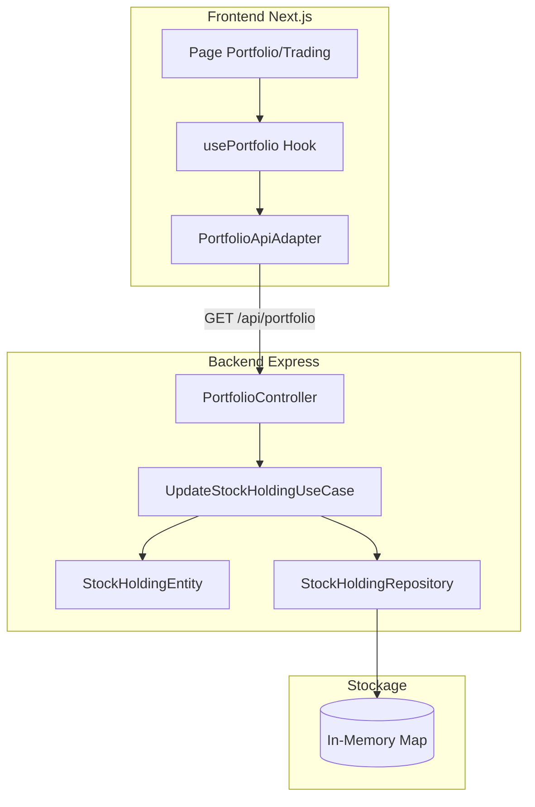
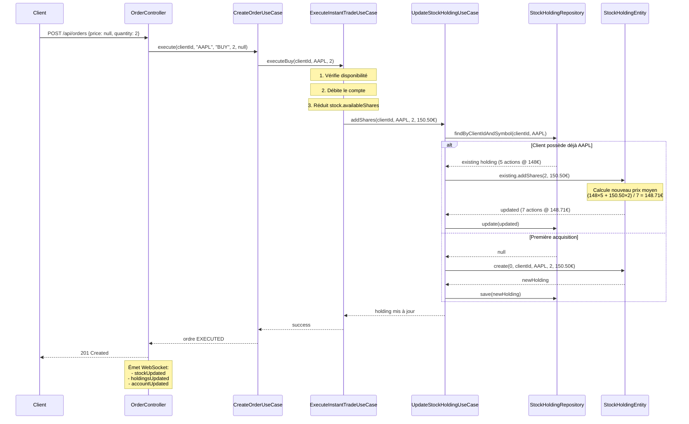

# Analyse complète : Système de gestion des possessions d'actions (Holdings)

Date : 7 janvier 2026

## Vue d'ensemble

Le système de gestion des holdings suit une architecture en couches respectant les principes DDD (Domain-Driven Design) :



## 1. Backend - Architecture du domaine

### 1.1 Entité StockHoldingEntity

**Fichier** : `domain/entities/StockHoldingEntity.ts`

**Propriétés** :
- `id`: number - Identifiant unique
- `clientId`: number - ID du client propriétaire
- `stockSymbol`: StockSymbol - Symbole de l'action (AAPL, GOOGL, etc.)
- `quantity`: number - Nombre d'actions possédées
- `averagePurchasePrice`: Amount - Prix moyen d'achat (calculé automatiquement)
- `createdAt`: Date
- `updatedAt`: Date

**Méthodes clés** :
```typescript
// Créer une nouvelle possession
static create(id, clientId, stockSymbol, quantity, purchasePrice): StockHoldingEntity | Error

// Ajouter des actions (recalcule le prix moyen)
addShares(quantity, purchasePrice): StockHoldingEntity | Error
// Formule: nouveauPrixMoyen = (ancienTotal + nouveauTotal) / nouvelleQuantité

// Retirer des actions
removeShares(quantity): StockHoldingEntity | Error

// Calculs
calculateCurrentValue(currentPrice): Amount  // quantité × prix actuel
calculateUnrealizedGainLoss(currentPrice): Amount  // valeur actuelle - coût total
```

### 1.2 Repository StockHoldingRepositoryInMemory

**Fichier** : `infrastructure/repositories/in-memory/StockHoldingRepositoryInMemory.ts`

**Stockage** : `Map<number, StockHoldingEntity>`

**Méthodes** :
- `findByClientId(clientId)`: Récupère tous les holdings d'un client (quantité > 0)
- `findByClientIdAndSymbol(clientId, symbol)`: Récupère un holding spécifique
- `save(holding)`: Crée ou met à jour un holding
  - **Important** : Vérifie s'il existe déjà un holding pour ce client/symbole
  - Si oui, met à jour l'existant au lieu de créer un doublon
- `update(holding)`: Met à jour un holding existant

### 1.3 Use Case UpdateStockHoldingUseCase

**Fichier** : `application/use-cases/investment/UpdateStockHoldingUseCase.ts`

**Méthode `addShares`** :
```typescript
async addShares(clientId, stockSymbol, quantity, purchasePrice) {
  // 1. Chercher si le client possède déjà cette action
  const existing = await repository.findByClientIdAndSymbol(clientId, stockSymbol);
  
  if (existing) {
    // 2a. Mettre à jour la possession existante
    const updated = existing.addShares(quantity, purchasePrice);
    await repository.update(updated);
    return updated;
  } else {
    // 2b. Créer une nouvelle possession
    const newHolding = StockHoldingEntity.create(0, clientId, stockSymbol, quantity, purchasePrice);
    await repository.save(newHolding);
    return newHolding;
  }
}
```

**Méthode `removeShares`** :
```typescript
async removeShares(clientId, stockSymbol, quantity) {
  // 1. Récupérer la possession existante
  const holding = await repository.findByClientIdAndSymbol(clientId, stockSymbol);
  
  if (!holding) {
    return new Error("Vous ne possédez pas cette action");
  }
  
  // 2. Retirer les actions
  const updated = holding.removeShares(quantity);
  await repository.update(updated);
  return updated;
}
```

## 2. Flux d'achat d'actions

### 2.1 Achat au prix du marché (InstantTrade)



### 2.2 Calcul du prix moyen

**Exemple concret** :

```
Situation initiale:
- Client possède 5 AAPL @ 148€/action
- Coût total actuel: 148 × 5 = 740€

Achat de 2 AAPL @ 150.50€/action:
- Coût de l'achat: 150.50 × 2 = 301€
- Nouveau coût total: 740 + 301 = 1041€
- Nouvelle quantité: 5 + 2 = 7
- Nouveau prix moyen: 1041 / 7 = 148.71€

Situation finale:
- Client possède 7 AAPL @ 148.71€/action
```

## 3. Backend - API Controller

### 3.1 PortfolioController

**Fichier** : `infrastructure/in-memory-api/controllers/PortfolioController.ts`

**Route `GET /api/portfolio`** :
```typescript
async (req, res) => {
  const userId = req.userId;
  
  // 1. Récupérer tous les holdings du client
  const holdings = await stockHoldingRepository.findByClientId(userId);
  
  // 2. Récupérer toutes les actions pour les prix actuels
  const allStocks = await stockRepository.findAll();
  const stocksMap = new Map();
  allStocks.forEach(stock => stocksMap.set(stock.symbol, stock));
  
  // 3. Enrichir les holdings avec les prix actuels
  const portfolio = holdings
    .filter(h => h.quantity > 0)
    .map(holding => {
      const stock = stocksMap.get(holding.stockSymbol);
      return {
        id: holding.id,
        stockSymbol: holding.stockSymbol,
        quantity: holding.quantity,
        averagePurchasePrice: holding.averagePurchasePrice,
        currentPrice: stock.currentPrice,
        currentValue: holding.quantity × stock.currentPrice,
        unrealizedGainLoss: currentValue - (averagePurchasePrice × quantity)
      };
    });
  
  // 4. Calculer les totaux
  const totalValue = portfolio.reduce((sum, h) => sum + h.currentValue, 0);
  const totalGainLoss = portfolio.reduce((sum, h) => sum + h.unrealizedGainLoss, 0);
  
  res.json({ holdings: portfolio, totalValue, totalGainLoss });
}
```

**Route `GET /api/portfolio/:stockSymbol`** :
```typescript
async (req, res) => {
  const userId = req.userId;
  const symbol = StockSymbol.create(req.params.stockSymbol);
  
  // Récupérer le holding spécifique
  const holding = await stockHoldingRepository.findByClientIdAndSymbol(userId, symbol);
  
  if (!holding || holding.quantity === 0) {
    return res.status(404).json({ error: "Vous ne possédez pas cette action" });
  }
  
  // Récupérer le prix actuel
  const stock = await stockRepository.findBySymbol(symbol);
  
  res.json({
    ...holding,
    currentPrice: stock.currentPrice,
    currentValue: holding.quantity × stock.currentPrice
  });
}
```

## 4. Frontend - Affichage du portfolio

### 4.1 Hook usePortfolio

**Fichier** : `infrastructure/nextjs-frontend/src/presentation/hooks/usePortfolio.ts`

```typescript
export const usePortfolio = (userId: number | null) => {
  const [portfolio, setPortfolio] = useState<PortfolioDto | null>(null);
  const [loading, setLoading] = useState(true);
  
  const loadPortfolio = async () => {
    if (!userId) return;
    
    const result = await portfolioService.getPortfolio(userId);
    if (result instanceof Error) {
      setError(result.message);
      return;
    }
    
    setPortfolio(result);
  };
  
  useEffect(() => {
    if (userId) {
      loadPortfolio();
    }
  }, [userId]);
  
  return {
    portfolio,
    holdings: portfolio?.holdings || [],
    totalValue: portfolio?.totalValue || 0,
    totalGainLoss: portfolio?.totalGainLoss || 0,
    loading,
    error,
    refresh: loadPortfolio,
  };
};
```

### 4.2 Page Portfolio

**Fichier** : `infrastructure/nextjs-frontend/app/portfolio/page.tsx`

```tsx
export default function PortfolioPage() {
  const { user } = useAuth();
  const { holdings, totalValue, totalGainLoss, loading } = usePortfolio(user?.id || null);
  
  return (
    <div>
      <h1>Mon Portefeuille</h1>
      <div>
        <p>Valeur totale: {formatAmount(totalValue)}</p>
        <p className={totalGainLoss >= 0 ? "text-green" : "text-red"}>
          Gain/Perte: {formatAmount(totalGainLoss)}
        </p>
      </div>
      
      <table>
        <thead>
          <tr>
            <th>Action</th>
            <th>Quantité</th>
            <th>Prix moyen</th>
            <th>Prix actuel</th>
            <th>Valeur</th>
            <th>Gain/Perte</th>
          </tr>
        </thead>
        <tbody>
          {holdings.map(holding => (
            <tr key={holding.id}>
              <td>{holding.stockSymbol}</td>
              <td>{holding.quantity}</td>
              <td>{formatAmount(holding.averagePurchasePrice)}</td>
              <td>{formatAmount(holding.currentPrice)}</td>
              <td>{formatAmount(holding.currentValue)}</td>
              <td className={holding.gainLoss >= 0 ? "green" : "red"}>
                {formatAmount(holding.gainLoss)}
              </td>
            </tr>
          ))}
        </tbody>
      </table>
    </div>
  );
}
```

### 4.3 API Adapter

**Fichier** : `infrastructure/nextjs-frontend/src/infrastructure/api/PortfolioApiAdapter.ts`

```typescript
export class PortfolioApiAdapter implements PortfolioServiceInterface {
  async getPortfolio(userId: number): Promise<PortfolioDto | Error> {
    try {
      return await apiClient.get<PortfolioDto>('/api/portfolio');
    } catch (error: any) {
      return new Error(error.response?.data?.error || 'Erreur récupération portfolio');
    }
  }
  
  async getHoldingBySymbol(userId: number, stockSymbol: string): Promise<StockHoldingDto | Error> {
    try {
      return await apiClient.get<StockHoldingDto>(`/api/portfolio/${stockSymbol}`);
    } catch (error: any) {
      return new Error(error.response?.data?.error || 'Erreur récupération holding');
    }
  }
}
```

## 5. Vérification du système actuel

### ✅ Points validés (Backend)

1. **Entité StockHoldingEntity** : 
   - ✅ Calcul automatique du prix moyen dans `addShares()`
   - ✅ Gestion de la quantité dans `removeShares()`
   - ✅ Méthodes de calcul de valeur et gain/perte

2. **Repository** :
   - ✅ `findByClientId()` filtre quantité > 0
   - ✅ `save()` évite les doublons (vérifie existence)
   - ✅ Stockage en mémoire avec Map

3. **Use Cases** :
   - ✅ `UpdateStockHoldingUseCase.addShares()` utilisé dans :
     - `ExecuteInstantTradeUseCase.executeBuy()`
     - `ExecuteMatchedOrdersUseCase.executeMatch()`
   - ✅ `UpdateStockHoldingUseCase.removeShares()` utilisé dans :
     - `ExecuteInstantTradeUseCase.executeSell()`
     - `ExecuteMatchedOrdersUseCase.executeMatch()`

4. **API Controller** :
   - ✅ `GET /api/portfolio` retourne holdings enrichis avec prix actuels
   - ✅ Calcul des totaux (valeur, gain/perte)
   - ✅ Filtre holdings avec quantité > 0

### ✅ Points validés (Frontend)

1. **Hook usePortfolio** :
   - ✅ Appelle `/api/portfolio` au chargement
   - ✅ Expose `holdings`, `totalValue`, `totalGainLoss`
   - ✅ Fonction `refresh()` pour recharger

2. **Page Portfolio** :
   - ✅ Affiche tableau des holdings
   - ✅ Affiche valeur actuelle et gain/perte
   - ✅ Formatage des montants

3. **API Adapter** :
   - ✅ Implémente `PortfolioServiceInterface`
   - ✅ Gestion d'erreurs appropriée

## 6. Flux complet d'un achat

```
1. Client clique "Acheter 2 AAPL" au prix du marché (150,50€)
   ↓
2. POST /api/orders {stockSymbol: "AAPL", orderType: "BUY", quantity: 2, price: null}
   ↓
3. CreateOrderUseCase détecte price === null
   ↓
4. ExecuteInstantTradeUseCase.executeBuy():
   a. Débite 302€ du compte (301€ + 1€ frais)
   b. Réduit stock.availableShares de 2
   c. Appelle UpdateStockHoldingUseCase.addShares(clientId, AAPL, 2, 150.50€)
      - Si client possède déjà AAPL: met à jour holding existant + recalcule prix moyen
      - Sinon: crée nouveau holding
   d. Crée opération COMPLETED
   e. Crée notification
   ↓
5. OrderController émet WebSocket "holdingsUpdated"
   ↓
6. Frontend (si actif) reçoit l'événement et rafraîchit le portfolio
   ↓
7. Client voit ses nouvelles actions dans le portfolio
```

## 7. Recommandations

### ✅ Le système backend est complet et fonctionnel

**Aucune modification nécessaire** côté backend pour la gestion des holdings.

### Frontend - Améliorations suggérées

1. **Intégration WebSocket dans usePortfolio** :
   ```typescript
   // Écouter les mises à jour de holdings en temps réel
   useEffect(() => {
     if (socket && userId) {
       socket.on('holdingsUpdated', (holdings) => {
         loadPortfolio(); // Rafraîchir le portfolio
       });
       return () => socket.off('holdingsUpdated');
     }
   }, [socket, userId]);
   ```

2. **Affichage du nombre d'actions possédées sur la page de trading** :
   - Ajouter `usePortfolio` ou `getHoldingBySymbol` dans `trading/[symbol]/page.tsx`
   - Afficher "Vous possédez X actions" avant le formulaire d'ordre

3. **Validation côté frontend** :
   - Vérifier qu'on possède assez d'actions avant d'essayer de vendre
   - Afficher un message clair si quantité insuffisante

## 8. Conclusion

Le système de gestion des holdings est **robuste et bien architecturé** :

✅ **Backend** : Complet et fonctionnel
- Entité domain avec logique métier
- Repository avec prévention de doublons
- Use cases réutilisables
- API REST claire

✅ **Frontend** : Fonctionnel avec possibilité d'amélioration
- Hook réutilisable
- Page portfolio claire
- Adapter pour l'API

🔄 **Flux de données** : Clair et prévisible
- Achat → UpdateStockHolding.addShares()
- Vente → UpdateStockHolding.removeShares()
- Consultation → PortfolioController.getPortfolio()

Le système est prêt pour la production ! 🎉

