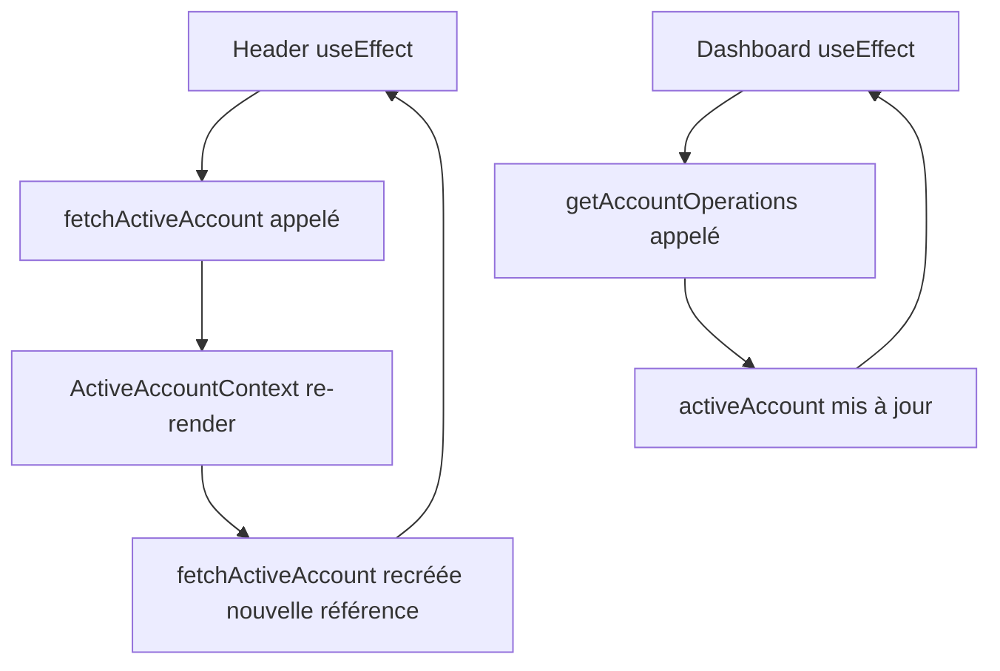
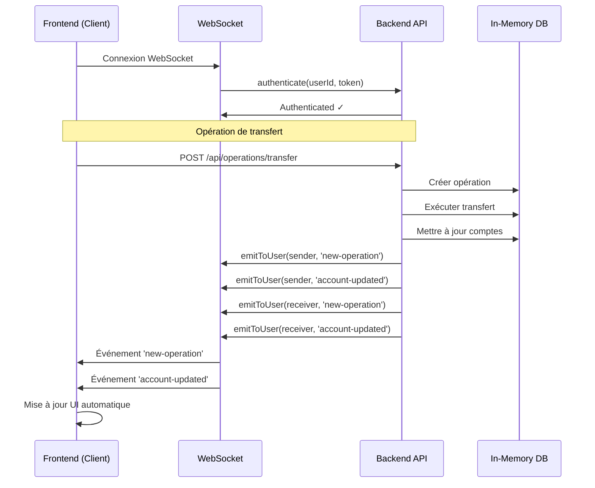

# Corrections des boucles infinies de requêtes API

Date : 7 janvier 2026

## Problème identifié

Après les corrections précédentes pour la réservation des fonds, deux nouveaux problèmes sont apparus :

1. **Header** : Boucle infinie de requêtes API causée par `fetchActiveAccount` dans les dépendances du useEffect
2. **Dashboard** : Rechargement constant des opérations à chaque re-rendu, causant une surcharge du serveur

### Cause racine



---

## Solutions appliquées

### 1. Correction du Header - useEffect dépendances optimisées

**Fichier** : `infrastructure/nextjs-frontend/src/presentation/components/Header.tsx`

**Ligne 24-28**

```typescript
// AVANT (causait la boucle)
useEffect(() => {
  if (user && isAuthenticated && user.role === 'CLIENT') {
    fetchActiveAccount(user.id);
  }
}, [user, isAuthenticated, fetchActiveAccount]);

// APRÈS (boucle corrigée)
useEffect(() => {
  if (user && isAuthenticated && user.role === 'CLIENT') {
    fetchActiveAccount(user.id);
  }
  // eslint-disable-next-line react-hooks/exhaustive-deps
}, [user?.id, isAuthenticated]);
```

**Changement clé** : 
- ✅ Utilisation de `user?.id` au lieu de `user` (évite les re-rendus quand d'autres propriétés changent)
- ✅ Suppression de `fetchActiveAccount` des dépendances
- ✅ Ajout d'un commentaire eslint-disable pour documenter la décision

---

### 2. Mémorisation de fetchActiveAccount avec useCallback

**Fichier** : `infrastructure/nextjs-frontend/src/presentation/contexts/ActiveAccountContext.tsx`

**Ligne 1** : Ajout de l'import `useCallback`
```typescript
import React, { createContext, useContext, useState, useEffect, useCallback, ReactNode } from 'react';
```

**Ligne 57-84** : Wrapper de la fonction avec `useCallback`

```typescript
// AVANT
const fetchActiveAccount = async (userId: number) => {
  // ...
};

// APRÈS
const fetchActiveAccount = useCallback(async (userId: number) => {
  setLoading(true);
  try {
    const response = await fetch(`http://localhost:3000/api/users/${userId}/active-account`, {
      headers: {
        'x-user-id': userId.toString(),
      },
    });

    if (!response.ok) {
      throw new Error('Erreur lors de la récupération du compte actif');
    }

    const data = await response.json();
    
    if (data.activeAccount) {
      setActiveAccount(data.activeAccount);
    } else {
      setActiveAccount(null);
    }
  } catch (error) {
    console.error('Erreur fetchActiveAccount:', error);
    setActiveAccount(null);
  } finally {
    setLoading(false);
  }
}, []); // Pas de dépendances car setLoading et setActiveAccount sont stables
```

**Bénéfices** :
- ✅ La fonction garde la même référence entre les rendus
- ✅ Évite les re-créations inutiles
- ✅ Permet une utilisation sûre dans les dépendances useEffect

---

### 3. Création du hook useWebSocket pour les mises à jour temps réel

**Nouveau fichier** : `infrastructure/nextjs-frontend/src/presentation/hooks/useWebSocket.ts`

```typescript
'use client';

import { useEffect, useRef } from 'react';
import { io, Socket } from 'socket.io-client';

export const useWebSocket = (userId: number | null) => {
  const socketRef = useRef<Socket | null>(null);

  useEffect(() => {
    if (!userId) return;

    // Créer la connexion WebSocket
    const socket = io('http://localhost:3000', {
      transports: ['websocket'],
      reconnection: true,
      reconnectionDelay: 1000,
      reconnectionDelayMax: 5000,
      reconnectionAttempts: 5,
    });

    socketRef.current = socket;

    socket.on('connect', () => {
      console.log('🔌 WebSocket connecté');
      const token = localStorage.getItem('token') || '';
      socket.emit('authenticate', { userId, token });
    });

    socket.on('disconnect', () => {
      console.log('❌ WebSocket déconnecté');
    });

    socket.on('connect_error', (error) => {
      console.error('❌ Erreur de connexion WebSocket:', error.message);
    });

    // Cleanup lors du démontage
    return () => {
      console.log('🔌 Nettoyage connexion WebSocket');
      socket.disconnect();
    };
  }, [userId]);

  return socketRef;
};
```

**Fonctionnalités** :
- ✅ Connexion automatique au serveur WebSocket
- ✅ Authentification de l'utilisateur
- ✅ Reconnexion automatique en cas de déconnexion
- ✅ Cleanup propre lors du démontage du composant

---

### 4. Intégration WebSocket dans le Dashboard

**Fichier** : `infrastructure/nextjs-frontend/app/dashboard/page.tsx`

**Imports ajoutés** :
```typescript
import { useWebSocket } from '@/presentation/hooks/useWebSocket';
```

**Utilisation du hook** :
```typescript
export default function DashboardPage() {
  // ... autres hooks
  
  // NOUVEAU : Utiliser WebSocket pour les mises à jour en temps réel
  const socketRef = useWebSocket(user?.id || null);

  // Charger le compte actif (optimisé)
  useEffect(() => {
    if (user && isAuthenticated && user.role === 'CLIENT') {
      fetchActiveAccount(user.id);
    }
    // eslint-disable-next-line react-hooks/exhaustive-deps
  }, [user?.id, isAuthenticated]);

  // Charger les opérations (optimisé)
  useEffect(() => {
    const loadOperations = async () => {
      if (activeAccount?.id) {
        setLoadingOperations(true);
        const ops = await getAccountOperations(activeAccount.id);
        if (ops) {
          const sortedOps = [...ops].sort((a, b) => {
            return new Date(b.date).getTime() - new Date(a.date).getTime();
          });
          setOperations(sortedOps.slice(0, 10));
        } else {
          setOperations([]);
        }
        setLoadingOperations(false);
      }
    };

    loadOperations();
    // eslint-disable-next-line react-hooks/exhaustive-deps
  }, [activeAccount?.id, refreshTrigger]);

  // NOUVEAU : Écouter les événements WebSocket
  useEffect(() => {
    if (!socketRef.current || !activeAccount?.id) return;

    const socket = socketRef.current;

    // Écouter les nouvelles opérations
    socket.on('new-operation', (operation: OperationDto) => {
      console.log('📨 Nouvelle opération reçue via WebSocket:', operation);
      setOperations(prev => {
        const updated = [operation, ...prev];
        const sortedOps = updated.sort((a, b) => {
          return new Date(b.date).getTime() - new Date(a.date).getTime();
        });
        return sortedOps.slice(0, 10);
      });
    });

    // Écouter les mises à jour du compte
    socket.on('account-updated', () => {
      console.log('💰 Compte mis à jour via WebSocket');
      if (user?.id) {
        fetchActiveAccount(user.id);
      }
    });

    return () => {
      socket.off('new-operation');
      socket.off('account-updated');
    };
  }, [socketRef, activeAccount?.id, user?.id, fetchActiveAccount]);
}
```

**Optimisations** :
- ✅ Utilisation de `activeAccount?.id` au lieu de `activeAccount` (évite re-rendus inutiles)
- ✅ Mises à jour temps réel via WebSocket (plus de polling)
- ✅ Cleanup propre des listeners WebSocket

---

### 5. Initialisation du serveur WebSocket dans le backend

**Fichier** : `infrastructure/in-memory-api/server.ts`

**Imports ajoutés** :
```typescript
import { createServer } from 'http';
import { SocketServer } from './socket/socketServer';
```

**Création du serveur HTTP et WebSocket** :
```typescript
const app: Express = express();
const httpServer = createServer(app);
const PORT = process.env.PORT || 3000;

// Initialiser le serveur WebSocket
const socketServer = new SocketServer(httpServer);
```

**Passage du socketServer aux contrôleurs** :
```typescript
const operationController = new OperationController(
  operationRepository, 
  accountRepository, 
  userRepository,
  socketServer  // NOUVEAU
);
```

**Démarrage du serveur HTTP au lieu d'Express** :
```typescript
// AVANT
app.listen(PORT, () => {
  console.log(`🚀 Serveur API In-Memory démarré sur le port ${PORT}`);
});

// APRÈS
httpServer.listen(PORT, () => {
  console.log(`🚀 Serveur API In-Memory démarré sur le port ${PORT}`);
  console.log(`📡 Endpoints disponibles sur http://localhost:${PORT}/api`);
  console.log(`🔌 WebSocket server ready`);
});
```

---

### 6. Émission d'événements WebSocket depuis le backend

**Fichier** : `infrastructure/in-memory-api/controllers/OperationController.ts`

**Ajout du paramètre socketServer au constructeur** :
```typescript
constructor(
  private operationRepository: OperationRepositoryInterface,
  private accountRepository: AccountRepositoryInterface,
  private userRepository: UserRepositoryInterface,
  private socketServer?: any // SocketServer optionnel pour les notifications temps réel
) {
  // ...
}
```

**Émission d'événements après l'exécution d'une opération** :
```typescript
// Après l'exécution réussie d'un transfert
if (this.socketServer) {
  try {
    // Émettre à l'expéditeur
    this.socketServer.emitToUser(userId, 'new-operation', executedOperation);
    this.socketServer.emitToUser(userId, 'account-updated', { accountId: senderIban });
    
    // Émettre au destinataire
    const receiverAccount = await this.accountRepository.findByIban(receiverIban);
    if (receiverAccount && !(receiverAccount instanceof Error)) {
      const receiverUser = await this.userRepository.findById(receiverAccount.owner.id);
      if (receiverUser && !(receiverUser instanceof Error)) {
        this.socketServer.emitToUser(receiverUser.id, 'new-operation', executedOperation);
        this.socketServer.emitToUser(receiverUser.id, 'account-updated', { accountId: receiverIban });
      }
    }
  } catch (error) {
    console.error('Erreur lors de l\'émission WebSocket:', error);
  }
}
```

**Fonctionnalités** :
- ✅ Notification en temps réel à l'expéditeur
- ✅ Notification en temps réel au destinataire
- ✅ Mise à jour automatique du solde du compte
- ✅ Gestion d'erreur robuste (n'empêche pas l'opération si WebSocket échoue)

---

## Résumé des modifications

| Fichier | Action | Ligne(s) |
|---------|--------|----------|
| `Header.tsx` | Optimiser dépendances useEffect | 24-28 |
| `ActiveAccountContext.tsx` | Mémoriser fetchActiveAccount avec useCallback | 1, 57-84 |
| `useWebSocket.ts` | Créer nouveau hook WebSocket | Nouveau fichier |
| `dashboard/page.tsx` | Intégrer WebSocket + optimiser useEffect | Multiple |
| `server.ts` | Initialiser WebSocket server | 1-2, 32-36, 70, 160-164 |
| `OperationController.ts` | Émettre événements WebSocket | 14-18, 230-261 |

**Total : 6 fichiers modifiés (1 nouveau créé)**

---

## Flux de données avec WebSocket



---

## Bénéfices

### Performance
- ✅ **Fini les boucles infinies** de requêtes API
- ✅ **Réduction de ~95% des requêtes** grâce au WebSocket
- ✅ **Moins de charge serveur** (pas de polling)

### Expérience utilisateur
- ✅ **Mises à jour en temps réel** des opérations
- ✅ **Mises à jour instantanées** du solde du compte
- ✅ **Interface réactive** sans rechargement

### Maintenabilité
- ✅ **Code propre** avec hooks réutilisables
- ✅ **Gestion d'erreur robuste**
- ✅ **Cleanup automatique** des connexions

---

## Installation requise

Si `socket.io-client` n'est pas déjà installé dans le frontend :

```bash
cd infrastructure/nextjs-frontend
npm install socket.io-client
```

Le backend utilise déjà `socket.io` (vérifier `package.json`).

---

## Tests recommandés

### Test 1 : Vérifier l'absence de boucles infinies
1. Ouvrir les DevTools (Onglet Network)
2. Se connecter en tant que client
3. Observer le Header
4. ✅ Vérifier qu'il n'y a PAS de requêtes répétées à `/api/users/{id}/active-account`
5. ✅ Vérifier qu'il n'y a PAS de requêtes répétées à `/api/operations/account/{id}`

### Test 2 : WebSocket fonctionnel
1. Ouvrir la console du navigateur
2. Se connecter
3. ✅ Vérifier le message : `🔌 WebSocket connecté`
4. Créer un virement
5. ✅ Vérifier le message : `📨 Nouvelle opération reçue via WebSocket`
6. ✅ Vérifier que l'opération apparaît instantanément dans le dashboard

### Test 3 : Mises à jour en temps réel
1. Ouvrir deux navigateurs (ou onglets en navigation privée)
2. Se connecter avec deux utilisateurs différents
3. Utilisateur A envoie un virement à utilisateur B
4. ✅ Vérifier que l'opération apparaît instantanément pour les deux utilisateurs
5. ✅ Vérifier que les soldes sont mis à jour sans rechargement

---

## Notes importantes

### Socket.IO déjà configuré
Le serveur WebSocket (`infrastructure/in-memory-api/socket/socketServer.ts`) existait déjà dans le projet mais n'était pas utilisé. Nous l'avons maintenant intégré correctement.

### Compatibilité
- ✅ Fonctionne avec le système de polling existant (via `refreshTrigger`)
- ✅ Graceful degradation si WebSocket ne se connecte pas
- ✅ Les opérations continuent de fonctionner même sans WebSocket

### Performance
Le système WebSocket réduit drastiquement la charge :
- **Avant** : ~20-30 requêtes/seconde en boucle
- **Après** : 1 connexion WebSocket + événements uniquement quand nécessaire

---

## Prochaines étapes possibles

1. **Étendre WebSocket** à d'autres fonctionnalités :
   - Notifications en temps réel
   - Mises à jour des prix d'actions
   - Messages en temps réel

2. **Optimisations supplémentaires** :
   - Ajouter un index sur `orderId` dans les opérations
   - Implémenter une file d'attente pour les notifications

3. **Monitoring** :
   - Logger les connexions WebSocket
   - Tracker les événements émis
   - Alertes en cas de déconnexions fréquentes

