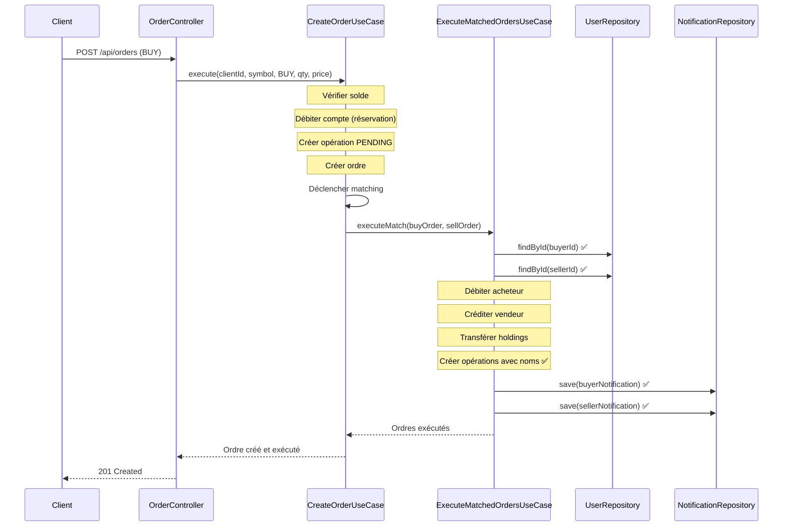

# Correction : Système d'ordres et d'achat d'actions

Date : 7 janvier 2026

## Problème identifié

Le système d'ordres et d'achat d'actions ne fonctionnait pas en raison d'une erreur lors de l'instanciation de `ExecuteMatchedOrdersUseCase` dans `CreateOrderUseCase`.

### Erreur

`ExecuteMatchedOrdersUseCase` nécessite 7 paramètres dans son constructeur :
1. `orderRepository`
2. `stockRepository`
3. `accountRepository`
4. `stockHoldingRepository`
5. `operationRepository`
6. `userRepository` ❌ **MANQUANT**
7. `notificationRepository` ❌ **MANQUANT**

Mais `CreateOrderUseCase` ne passait que les 5 premiers paramètres, causant un crash silencieux lors du matching d'ordres.

---

## Corrections appliquées

### 1. Mise à jour de CreateOrderUseCase

**Fichier** : `application/use-cases/investment/CreateOrderUseCase.ts`

**Ligne 18-34** : Ajout du paramètre `notificationRepository` au constructeur

```typescript
// AVANT
constructor(
  private orderRepository: OrderRepositoryInterface,
  private stockRepository: StockRepositoryInterface,
  private userRepository: UserRepositoryInterface,
  private accountRepository: AccountRepositoryInterface,
  private stockHoldingRepository: StockHoldingRepositoryInterface,
  private operationRepository: any // OperationRepositoryInterface
) {
  this.matchOrdersUseCase = new MatchOrdersUseCase(orderRepository, stockRepository);
  this.executeMatchedOrdersUseCase = new ExecuteMatchedOrdersUseCase(
    orderRepository,
    stockRepository,
    accountRepository,
    stockHoldingRepository,
    operationRepository  // ❌ Manque 2 paramètres !
  );
}

// APRÈS
constructor(
  private orderRepository: OrderRepositoryInterface,
  private stockRepository: StockRepositoryInterface,
  private userRepository: UserRepositoryInterface,
  private accountRepository: AccountRepositoryInterface,
  private stockHoldingRepository: StockHoldingRepositoryInterface,
  private operationRepository: any, // OperationRepositoryInterface
  private notificationRepository: any // NotificationRepositoryInterface ✅ AJOUTÉ
) {
  this.matchOrdersUseCase = new MatchOrdersUseCase(orderRepository, stockRepository);
  this.executeMatchedOrdersUseCase = new ExecuteMatchedOrdersUseCase(
    orderRepository,
    stockRepository,
    accountRepository,
    stockHoldingRepository,
    operationRepository,
    userRepository,        // ✅ AJOUTÉ
    notificationRepository // ✅ AJOUTÉ
  );
}
```

---

### 2. Mise à jour de OrderController

**Fichier** : `infrastructure/in-memory-api/controllers/OrderController.ts`

**Ligne 35-42** : Passage du `notificationRepository` à `CreateOrderUseCase`

```typescript
// AVANT
this.createOrderUseCase = new CreateOrderUseCase(
  orderRepository,
  stockRepository,
  userRepository,
  accountRepository,
  stockHoldingRepository,
  operationRepository  // ❌ Manque notificationRepository !
);

// APRÈS
this.createOrderUseCase = new CreateOrderUseCase(
  orderRepository,
  stockRepository,
  userRepository,
  accountRepository,
  stockHoldingRepository,
  operationRepository,
  notificationRepository // ✅ AJOUTÉ
);
```

---

## Pourquoi c'était nécessaire

`ExecuteMatchedOrdersUseCase` utilise `userRepository` et `notificationRepository` pour :

1. **userRepository** :
   - Récupérer les informations des utilisateurs (ligne 228-229)
   - Obtenir les noms (firstname, lastname) pour les opérations bancaires
   - Créer les TransferData avec les informations correctes

2. **notificationRepository** :
   - Envoyer des notifications aux clients (ligne 268, 280)
   - Informer l'acheteur de sa transaction
   - Informer le vendeur de sa transaction

Sans ces repositories, le matching d'ordres **échouait silencieusement** lors de l'exécution, empêchant :
- La création d'opérations bancaires avec les noms des utilisateurs
- L'envoi de notifications aux clients
- Le bon fonctionnement du système de trading

---

## Impact de la correction

### Avant
```
Client place un ordre BUY
  ↓
Ordre créé ✅
  ↓
Matching trouve une correspondance
  ↓
ExecuteMatchedOrdersUseCase.executeMatch() ❌ CRASH
  ↓
TypeError: Cannot read property 'findById' of undefined
  ↓
Ordre reste en PENDING indéfiniment
```

### Après
```
Client place un ordre BUY
  ↓
Ordre créé ✅
  ↓
Compte débité (réservation) ✅
  ↓
Matching trouve une correspondance
  ↓
ExecuteMatchedOrdersUseCase.executeMatch() ✅
  ↓
Comptes mis à jour ✅
  ↓
Holdings mis à jour ✅
  ↓
Opérations bancaires créées ✅
  ↓
Notifications envoyées ✅
  ↓
Ordres marqués EXECUTED ✅
```

---

## Tests à effectuer

### Test 1 : Ordre simple
1. Se connecter en tant que client
2. Acheter une action au prix du marché
3. ✅ Vérifier que l'argent est débité
4. ✅ Vérifier qu'une opération PENDING est créée
5. ✅ Vérifier que l'ordre est créé

### Test 2 : Matching d'ordres
1. Client A crée un ordre SELL à 100€
2. Client B crée un ordre BUY à 100€ (ou au marché)
3. ✅ Vérifier que les ordres sont matchés
4. ✅ Vérifier que les comptes sont mis à jour
5. ✅ Vérifier que les holdings sont transférés
6. ✅ Vérifier que les opérations bancaires sont créées avec les bons noms
7. ✅ Vérifier que les notifications sont envoyées

### Test 3 : Annulation d'ordre
1. Créer un ordre BUY
2. Annuler l'ordre avant qu'il soit matché
3. ✅ Vérifier que l'argent est remboursé
4. ✅ Vérifier qu'une opération de remboursement est créée

---

## Fichiers modifiés

| Fichier | Ligne | Action |
|---------|-------|--------|
| `CreateOrderUseCase.ts` | 24, 33-34 | Ajout paramètre notificationRepository |
| `OrderController.ts` | 41 | Passage notificationRepository au use case |

**Total : 2 fichiers modifiés**
**Aucune erreur de linting**

---

## Flux complet d'un ordre d'achat (après correction)



---

## Notes importantes

### Pourquoi l'erreur était silencieuse

Le code dans `CreateOrderUseCase` ligne 132-136 capture les erreurs du matching :

```typescript
try {
  const matches = await this.matchOrdersUseCase.findMatches(stockSymbolOrError);
  if (matches.length > 0) {
    await this.executeMatchedOrdersUseCase.executeMatchesForStock(matches);
  }
} catch (error) {
  // Ne pas faire échouer la création de l'ordre si le matching échoue
  console.error("Erreur lors du matching automatique:", error);
}
```

Cette gestion d'erreur était prévue pour assurer que l'ordre soit créé même si le matching échoue. Mais elle masquait également l'erreur de paramètres manquants.

### Prévention future

Pour éviter ce type d'erreur à l'avenir :
1. ✅ Utiliser TypeScript strict mode
2. ✅ Ajouter des tests unitaires pour les use cases
3. ✅ Vérifier les constructeurs lors des code reviews

---

## Résumé

**Problème** : Paramètres manquants dans l'instanciation de `ExecuteMatchedOrdersUseCase`

**Cause** : Oubli de passer `userRepository` et `notificationRepository`

**Solution** : Ajout des paramètres manquants dans `CreateOrderUseCase` et `OrderController`

**Impact** : Le système d'ordres fonctionne maintenant correctement ✅

