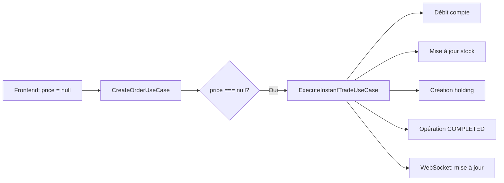
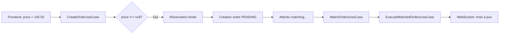

# Interface de Trading Complète - Style Binance

## 📋 Vue d'ensemble

L'interface de trading a été entièrement refaite avec un design moderne inspiré de Binance, en **mode clair (light mode)**, avec deux types d'opérations :

1. **Trading Spot** : Achat/Vente immédiat au prix du marché
2. **Ordres Limites** : Ordres à prix spécifique placés en attente

---

## 🎨 Composants créés

### 1. TradingHeader
**Fichier** : `infrastructure/nextjs-frontend/src/presentation/components/TradingHeader.tsx`

**Fonctionnalités** :
- Affichage du symbole et nom de l'action
- Prix actuel en grand
- Variation en % et en montant (colorisé)
- Breadcrumb pour navigation
- Quantité d'actions disponibles

---

### 2. SpotTradingPanel
**Fichier** : `infrastructure/nextjs-frontend/src/presentation/components/SpotTradingPanel.tsx`

**Fonctionnalités** :
- Onglets Acheter / Vendre
- Affichage du prix du marché
- Affichage du solde disponible (pour achat)
- Affichage des actions possédées (pour vente)
- Input quantité avec bouton MAX (pour vente)
- Calcul automatique du total + frais
- Validation avant soumission
- Exécution immédiate (price: null)

**Validations** :
- ✅ Empêche de vendre plus que possédé
- ✅ Vérifie le solde avant achat
- ✅ Désactive le bouton si quantité = 0

---

### 3. OrderBookPanel
**Fichier** : `infrastructure/nextjs-frontend/src/presentation/components/OrderBookPanel.tsx`

**Fonctionnalités** :
- Liste des ordres SELL (en rouge)
- Liste des ordres BUY (en vert)
- Barres de progression visuelles
- Prix d'équilibre calculé
- Section prix actuel mis en évidence
- Légende explicative

---

### 4. MyOrdersPanel
**Fichier** : `infrastructure/nextjs-frontend/src/presentation/components/MyOrdersPanel.tsx`

**Fonctionnalités** :
- Onglets "En attente" / "Historique"
- Badge de type (ACHAT/VENTE) colorisé
- Affichage détaillé : Prix, Quantité, Total
- Bouton d'annulation (pour ordres pending)
- Statut (Exécuté/Annulé) dans l'historique
- Date de création

---

### 5. LimitOrderModal ⭐ NOUVEAU
**Fichier** : `infrastructure/nextjs-frontend/src/presentation/components/LimitOrderModal.tsx`

**Fonctionnalités** :
- **Mini fenêtre modale** pour placer des ordres limites
- Onglets Ordre d'Achat / Ordre de Vente
- Input Prix Limite avec indicateur de % par rapport au prix actuel
- Input Quantité avec bouton MAX pour vente
- Affichage solde/actions possédées
- Récapitulatif (Montant + Frais = Total)
- Validation avant placement
- Message d'information sur l'ordre limite
- Animation d'ouverture/fermeture fluide

**Validations** :
- ✅ Avertissement si quantité > possédé
- ✅ Avertissement si total > solde
- ✅ Indicateur visuel : prix au-dessus/en-dessous du marché

---

## 📱 Page de Trading Refondée

**Fichier** : `infrastructure/nextjs-frontend/app/trading/[symbol]/page.tsx`

### Layout 3 colonnes

```
┌─────────────────────────────────────────────────────────┐
│                    TradingHeader                        │
│  AAPL - Apple Inc. | 150.50€ +2.50 (+1.69%)            │
└─────────────────────────────────────────────────────────┘
┌───────────────┬─────────────────────┬───────────────────┐
│               │                     │                   │
│  OrderBook    │   Spot Trading      │   Mes Ordres      │
│               │                     │                   │
│  [Ordres]     │   [Acheter/Vendre]  │   [En attente]    │
│               │   [Quantité]        │   [Historique]    │
│  Prix Actuel  │   [Total]           │                   │
│               │   [BOUTON CTA]      │   Ma Position     │
│               │                     │   (si détient)    │
│  Équilibre    │   + Ordre Limite    │                   │
│               │                     │                   │
└───────────────┴─────────────────────┴───────────────────┘
```

### Fonctions principales

1. **handleSpotTrade** : Trading immédiat (price: null)
2. **handleCreateLimitOrder** : Ordre limite (price: valeur)
3. **handleCancelOrder** : Annulation d'ordre pending

### Intégrations

- ✅ **WebSocket** : Rafraîchissement automatique
- ✅ **useStockRealtime** : Prix en temps réel
- ✅ **usePortfolio** : Holdings en temps réel
- ✅ **Toast messages** : Succès (vert) / Erreur (rouge)

---

## 🎨 Styles CSS (Light Mode)

**Fichier** : `infrastructure/nextjs-frontend/app/trading/[symbol]/binance.css`

### Variables de thème clair

```css
--bg-primary: #ffffff;      /* Blanc pur */
--bg-secondary: #fafafa;    /* Gris très clair */
--bg-tertiary: #f0f0f0;     /* Gris clair */
--text-primary: #1e1e1e;    /* Presque noir */
--text-secondary: #707070;  /* Gris moyen */
--text-tertiary: #a0a0a0;   /* Gris clair */
--color-buy: #0ecb81;       /* Vert (achats) */
--color-sell: #f6465d;      /* Rouge (ventes) */
--color-accent: #f0b90b;    /* Jaune/or */
--border-color: #e8e8e8;    /* Bordures */
```

### Styles de la modal

- **Backdrop** : Overlay semi-transparent
- **Animation** : Slide up + fade in
- **Responsive** : Max-width 500px
- **Scrollable** : Si contenu > hauteur écran
- **Accessibilité** : Fermeture par backdrop ou bouton X

---

## 🚀 Utilisation

### 1. Trading Spot (immédiat)

```
Aller sur /trading/AAPL
→ Colonne centrale "Spot Trading"
→ Cliquer "Acheter" ou "Vendre"
→ Entrer quantité
→ Cliquer "ACHETER AAPL" ou "VENDRE AAPL"
→ Exécution immédiate
```

### 2. Ordre Limite (en attente)

```
Aller sur /trading/AAPL
→ Colonne centrale "Spot Trading"
→ Cliquer "+ Placer un Ordre Limite"
→ Modal s'ouvre
→ Choisir type (Achat/Vente)
→ Entrer prix limite
→ Entrer quantité
→ Cliquer "PLACER L'ORDRE"
→ Ordre placé en attente (PENDING)
→ Sera exécuté quand prix atteint le niveau
```

---

## 📊 Différences : Spot vs Limite

| Critère | Trading Spot | Ordre Limite |
|---------|--------------|--------------|
| **Prix** | Prix du marché (automatique) | Prix spécifique (choisi) |
| **Exécution** | Immédiate | En attente (PENDING) |
| **Backend** | `ExecuteInstantTradeUseCase` | `CreateOrderUseCase` + Matching |
| **Statut** | EXECUTED | PENDING → EXECUTED |
| **Annulation** | Non applicable | Possible (remboursement) |

---

## 🔄 Flux Backend

### Trading Spot (price: null)



### Ordre Limite (price: valeur)



---

## ✅ Checklist des fonctionnalités

### Trading Spot
- [x] Panneau Acheter/Vendre
- [x] Prix du marché en temps réel
- [x] Validation quantité
- [x] Validation solde
- [x] Bouton MAX pour vente
- [x] Calcul total + frais
- [x] Exécution immédiate
- [x] WebSocket refresh

### Ordre Limite
- [x] Bouton ouverture modal
- [x] Modal design moderne
- [x] Input prix limite
- [x] Indicateur % vs marché
- [x] Input quantité
- [x] Récapitulatif
- [x] Validations
- [x] Placement ordre PENDING
- [x] Affichage dans "Mes Ordres"
- [x] Annulation possible

### Interface
- [x] Layout 3 colonnes
- [x] OrderBook visuel
- [x] Mes Ordres (En attente/Historique)
- [x] Ma Position (holdings)
- [x] Header avec breadcrumb
- [x] Toast messages
- [x] Thème clair (light mode)
- [x] Responsive design
- [x] Animations fluides

---

## 🎯 Points clés

1. **Deux modes de trading** : Spot (immédiat) vs Limite (attente)
2. **Interface claire et intuitive** : Séparation visuelle des fonctionnalités
3. **Validations complètes** : Empêche les erreurs utilisateur
4. **Feedback en temps réel** : WebSocket + Toast messages
5. **Design professionnel** : Inspiré de Binance, adapté en light mode

---

## 📝 Fichiers modifiés/créés

### Nouveaux composants
- `TradingHeader.tsx`
- `SpotTradingPanel.tsx`
- `OrderBookPanel.tsx`
- `MyOrdersPanel.tsx`
- `LimitOrderModal.tsx` ⭐

### Pages modifiées
- `app/trading/[symbol]/page.tsx` (refonte complète)

### Styles
- `app/trading/[symbol]/binance.css` (créé, ~800 lignes)

---

## 🚀 Prochaines étapes possibles

- [ ] Graphique de prix (chart.js ou recharts)
- [ ] Historique des trades
- [ ] Stop Loss / Take Profit
- [ ] Mode sombre (toggle dark/light)
- [ ] Ordres OCO (One Cancels Other)
- [ ] Notifications push pour exécution ordres

---

**Dernière mise à jour** : 7 janvier 2026
**Auteur** : Assistant IA
**Projet** : AVENIR Bank - Plateforme de Trading

