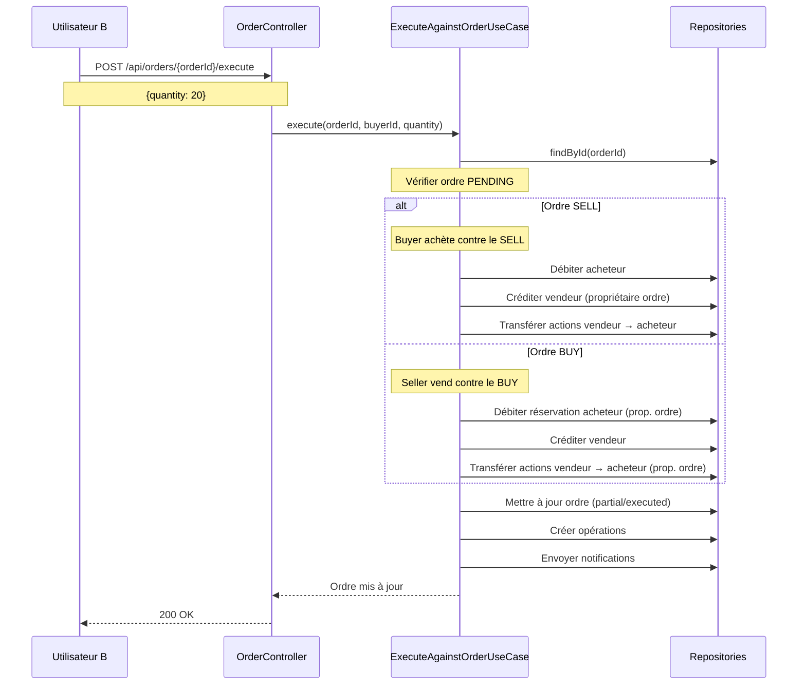

# Plan : Achat/Vente direct contre les ordres en attente

Date : 7 janvier 2026

## Objectif

Permettre à n'importe quel utilisateur d'acheter ou vendre des actions en exécutant partiellement ou totalement un ordre PENDING existant, sans avoir besoin de créer son propre ordre et d'attendre un match.

## Comportement souhaité

### Scénario 1 : Ordre de VENTE existant
```
Utilisateur A place un ordre SELL:
- Action: AAPL
- Quantité: 100 actions
- Prix: 150€

Utilisateur B peut acheter directement:
- Quantité souhaitée: 30 actions
- Prix: 150€ (prix de l'ordre)

Résultat:
✅ Utilisateur B: +30 actions, -4500€ (+ frais)
✅ Utilisateur A: -30 actions, +4500€ (- frais)
✅ Ordre A: 70 actions restantes (partiellement exécuté)
```

### Scénario 2 : Ordre d'ACHAT existant
```
Utilisateur A place un ordre BUY:
- Action: AAPL  
- Quantité: 50 actions
- Prix: 145€
- Argent réservé: 7250€ + frais

Utilisateur B peut vendre directement:
- Quantité: 20 actions (qu'il possède)
- Prix: 145€ (prix de l'ordre)

Résultat:
✅ Utilisateur A: +20 actions, argent reste réservé pour les 30 restantes
✅ Utilisateur B: -20 actions, +2900€ (- frais)
✅ Ordre A: 30 actions restantes (partiellement exécuté)
```

## Architecture



## Modifications à apporter

### 1. Créer le nouveau Use Case

**Nouveau fichier** : `application/use-cases/investment/ExecuteAgainstOrderUseCase.ts`

```typescript
export class ExecuteAgainstOrderUseCase {
  constructor(
    private orderRepository: OrderRepositoryInterface,
    private accountRepository: AccountRepositoryInterface,
    private stockHoldingRepository: StockHoldingRepositoryInterface,
    private operationRepository: OperationRepositoryInterface,
    private userRepository: UserRepositoryInterface,
    private notificationRepository: NotificationRepositoryInterface,
    private stockRepository: StockRepositoryInterface
  ) {}

  async execute(
    orderId: number,
    executorId: number,  // L'utilisateur qui veut acheter/vendre contre l'ordre
    quantity: number
  ): Promise<OrderEntity | Error> {
    // 1. Récupérer l'ordre
    const order = await this.orderRepository.findById(orderId);
    if (!order) return new Error("Ordre non trouvé");
    if (!order.isPending()) return new Error("L'ordre n'est plus disponible");

    // 2. Vérifier la quantité
    if (quantity <= 0) return new Error("Quantité invalide");
    if (quantity > order.getQuantity()) {
      return new Error(`Quantité demandée (${quantity}) supérieure à la quantité disponible (${order.getQuantity()})`);
    }

    // 3. Récupérer les informations
    const orderOwnerId = order.getClientId();
    if (executorId === orderOwnerId) {
      return new Error("Vous ne pouvez pas exécuter votre propre ordre");
    }

    const stock = await this.stockRepository.findBySymbol(order.getStockSymbol());
    if (!stock) return new Error("Action non trouvée");

    const orderPrice = order.getPrice();
    const transactionAmount = orderPrice.multiply(quantity);
    const fees = Amount.create(1);
    if (fees instanceof Error) return fees;

    // 4. Exécuter selon le type d'ordre
    if (order.getType().value === 'SELL') {
      // Ordre SELL: l'executor ACHÈTE contre cet ordre
      return await this.executeBuyAgainstSell(
        order, orderOwnerId, executorId, quantity, 
        transactionAmount, fees, stock
      );
    } else {
      // Ordre BUY: l'executor VEND contre cet ordre
      return await this.executeSellAgainstBuy(
        order, orderOwnerId, executorId, quantity,
        transactionAmount, fees, stock
      );
    }
  }

  private async executeBuyAgainstSell(
    order: OrderEntity,
    sellerId: number,
    buyerId: number,
    quantity: number,
    transactionAmount: Amount,
    fees: Amount,
    stock: StockEntity
  ): Promise<OrderEntity | Error> {
    // Acheteur paie le montant + frais
    const totalBuyAmount = transactionAmount.add(fees);
    
    // Vendeur reçoit le montant - frais
    const totalSellAmount = transactionAmount.subtract(fees);

    // Vérifier le solde de l'acheteur
    const buyerAccounts = await this.accountRepository.findByOwnerId(buyerId);
    if (buyerAccounts.length === 0) return new Error("L'acheteur n'a pas de compte");
    const buyerAccount = buyerAccounts[0];
    
    if (buyerAccount.balance.isLessThan(totalBuyAmount)) {
      return new Error("Solde insuffisant");
    }

    // Vérifier que le vendeur possède les actions
    const sellerHolding = await this.stockHoldingRepository.findByClientIdAndSymbol(
      sellerId,
      order.getStockSymbol()
    );
    if (!sellerHolding || sellerHolding.getQuantity() < quantity) {
      return new Error("Le vendeur ne possède pas assez d'actions");
    }

    // Débiter l'acheteur
    const debitedBuyerAccount = buyerAccount.debit(totalBuyAmount);
    if (debitedBuyerAccount instanceof Error) return debitedBuyerAccount;
    await this.accountRepository.update(debitedBuyerAccount);

    // Créditer le vendeur
    const sellerAccounts = await this.accountRepository.findByOwnerId(sellerId);
    if (sellerAccounts.length === 0) return new Error("Le vendeur n'a pas de compte");
    const sellerAccount = sellerAccounts[0];
    
    const creditedSellerAccount = sellerAccount.credit(totalSellAmount);
    if (creditedSellerAccount instanceof Error) return creditedSellerAccount;
    await this.accountRepository.update(creditedSellerAccount);

    // Transférer les actions: vendeur → acheteur
    const updateStockHoldingUseCase = new UpdateStockHoldingUseCase(this.stockHoldingRepository);
    await updateStockHoldingUseCase.removeShares(sellerId, order.getStockSymbol(), quantity);
    await updateStockHoldingUseCase.addShares(buyerId, order.getStockSymbol(), quantity, order.getPrice());

    // Mettre à jour l'ordre
    let updatedOrder: OrderEntity;
    if (quantity === order.getQuantity()) {
      updatedOrder = order.execute();
    } else {
      const partial = order.partiallyExecute(quantity);
      if (partial instanceof Error) return partial;
      updatedOrder = partial;
    }
    await this.orderRepository.update(updatedOrder);

    // Créer opérations et notifications
    await this.createOperationsAndNotifications(
      buyerId, sellerId, quantity, transactionAmount, 
      totalBuyAmount, totalSellAmount, order, stock
    );

    return updatedOrder;
  }

  private async executeSellAgainstBuy(
    order: OrderEntity,
    buyerId: number,
    sellerId: number,
    quantity: number,
    transactionAmount: Amount,
    fees: Amount,
    stock: StockEntity
  ): Promise<OrderEntity | Error> {
    // L'acheteur (propriétaire de l'ordre) a déjà réservé les fonds
    // Le vendeur doit posséder les actions

    const totalBuyAmount = transactionAmount.add(fees);
    const totalSellAmount = transactionAmount.subtract(fees);

    // Vérifier que le vendeur possède les actions
    const sellerHolding = await this.stockHoldingRepository.findByClientIdAndSymbol(
      sellerId,
      order.getStockSymbol()
    );
    if (!sellerHolding || sellerHolding.getQuantity() < quantity) {
      return new Error("Vous ne possédez pas assez d'actions");
    }

    // Gérer la réservation de l'acheteur
    // Trouver l'opération de réservation
    const allOps = await this.operationRepository.findAll();
    const reservationOp = allOps.find((op: any) => 
      op.status === 'PENDING' && 
      op.transferData?.reason?.includes(`ordre d'achat ${order.getStockSymbol().value}`)
    );

    if (reservationOp) {
      // Marquer une partie de la réservation comme complétée
      // Si exécution partielle, on garde la réservation PENDING
      // Si exécution totale, on marque COMPLETED
      if (quantity === order.getQuantity()) {
        const completedReservation = reservationOp.complete();
        await this.operationRepository.update(completedReservation);
      }
      // Sinon la réservation reste PENDING pour le reste
    }

    // Créditer le vendeur
    const sellerAccounts = await this.accountRepository.findByOwnerId(sellerId);
    if (sellerAccounts.length === 0) return new Error("Vous n'avez pas de compte");
    const sellerAccount = sellerAccounts[0];
    
    const creditedSellerAccount = sellerAccount.credit(totalSellAmount);
    if (creditedSellerAccount instanceof Error) return creditedSellerAccount;
    await this.accountRepository.update(creditedSellerAccount);

    // Transférer les actions: vendeur → acheteur
    const updateStockHoldingUseCase = new UpdateStockHoldingUseCase(this.stockHoldingRepository);
    await updateStockHoldingUseCase.removeShares(sellerId, order.getStockSymbol(), quantity);
    await updateStockHoldingUseCase.addShares(buyerId, order.getStockSymbol(), quantity, order.getPrice());

    // Mettre à jour l'ordre
    let updatedOrder: OrderEntity;
    if (quantity === order.getQuantity()) {
      updatedOrder = order.execute();
    } else {
      const partial = order.partiallyExecute(quantity);
      if (partial instanceof Error) return partial;
      updatedOrder = partial;
    }
    await this.orderRepository.update(updatedOrder);

    // Créer opérations et notifications
    await this.createOperationsAndNotifications(
      buyerId, sellerId, quantity, transactionAmount,
      totalBuyAmount, totalSellAmount, order, stock
    );

    return updatedOrder;
  }

  private async createOperationsAndNotifications(
    buyerId: number,
    sellerId: number,
    quantity: number,
    transactionAmount: Amount,
    totalBuyAmount: Amount,
    totalSellAmount: Amount,
    order: OrderEntity,
    stock: StockEntity
  ): Promise<void> {
    // Récupérer les utilisateurs
    const buyer = await this.userRepository.findById(buyerId);
    const seller = await this.userRepository.findById(sellerId);

    if (buyer && !(buyer instanceof Error) && seller && !(seller instanceof Error)) {
      const buyerAccounts = await this.accountRepository.findByOwnerId(buyerId);
      const sellerAccounts = await this.accountRepository.findByOwnerId(sellerId);

      if (buyerAccounts.length > 0 && sellerAccounts.length > 0) {
        // Créer TransferData et opérations...
        // (similaire à ExecuteMatchedOrdersUseCase)
      }
    }
  }
}
```

### 2. Ajouter le endpoint dans OrderController

**Fichier** : `infrastructure/in-memory-api/controllers/OrderController.ts`

```typescript
// POST /api/orders/:id/execute - Exécuter contre un ordre existant
this.router.post('/:id/execute', requireAuth, async (req: Request, res: Response) => {
  try {
    const orderId = parseInt(req.params.id);
    const executorId = (req as any).userId;
    const { quantity } = req.body;

    if (!quantity || quantity <= 0) {
      return res.status(400).json({ error: 'Quantité invalide' });
    }

    const result = await this.executeAgainstOrderUseCase.execute(
      orderId,
      executorId,
      quantity
    );

    if (result instanceof Error) {
      return res.status(400).json({ error: result.message });
    }

    res.json(this.toOrderDto(result));
  } catch (error: any) {
    res.status(500).json({ 
      error: 'Erreur lors de l\'exécution contre l\'ordre',
      details: error.message 
    });
  }
});
```

### 3. Modifier le frontend pour afficher les ordres disponibles

**Nouveau composant** : `infrastructure/nextjs-frontend/app/order-book/[symbol]/page.tsx`

Afficher tous les ordres PENDING pour une action avec :
- Prix
- Quantité disponible
- Bouton "Acheter" ou "Vendre" selon le type

### 4. Ajouter une page "Carnet d'ordres"

Permettre aux utilisateurs de :
- Voir tous les ordres SELL disponibles (pour acheter)
- Voir tous les ordres BUY disponibles (pour vendre)
- Filtrer par action
- Exécuter directement contre un ordre

## Avantages de cette approche

✅ **Simplicité** : Pas besoin de créer son propre ordre et attendre un match
✅ **Liquidité** : Les ordres en attente servent de market maker
✅ **Transparence** : Les utilisateurs voient exactement à quel prix ils peuvent acheter/vendre
✅ **Exécution immédiate** : Pas d'attente pour le matching
✅ **Flexibilité** : Possibilité d'exécution partielle

## Différence avec le système actuel

### Système actuel (Matching)
```
User A: SELL 100 @ 150€
User B: BUY 100 @ 150€
→ Système matche automatiquement
```

### Nouveau système (Exécution directe)
```
User A: SELL 100 @ 150€ (ordre en attente)
User B: Voit l'ordre et clique "Acheter 30 actions @ 150€"
→ Exécution immédiate, pas de matching
```

## Les deux systèmes coexistent

1. **Matching automatique** : Continue de fonctionner pour les ordres qui se matchent
2. **Exécution directe** : Nouvelle option pour exécuter manuellement contre un ordre

## Points d'attention

1. **Vérifier la propriété des actions** pour les ordres SELL
2. **Gérer la réservation d'argent** pour les ordres BUY
3. **Mettre à jour les holdings** correctement
4. **Créer les opérations bancaires** avec les bons noms
5. **Envoyer les notifications** aux deux parties

## Modifications du seed

✅ **FAIT** : Suppression de tous les ordres pré-créés dans le seed
- Les utilisateurs créeront leurs propres ordres via l'interface
- Carnet d'ordres vide au démarrage

